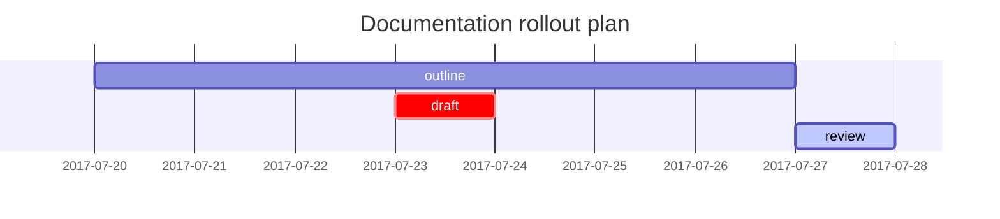

## Headings

<!-- markdownlint-capture -->
<!-- markdownlint-disable -->
# H1 — page title
{: .mt-4 .mb-0 }

## H2 — section title
{: data-toc-skip='' .mt-4 .mb-0 }

### H3 — subsection title
{: data-toc-skip='' .mt-4 .mb-0 }

#### H4 — minor heading
{: data-toc-skip='' .mt-4 }
<!-- markdownlint-restore -->

## Paragraph

This paragraph is a readability sample. It’s long enough to show line length, spacing, and how the theme handles continuous prose. Use it to verify font size, contrast, and rhythm across light/dark modes. If you paste your own copy here, keep a mix of short and medium sentences to see how it scans. ✍️

## Lists

### Ordered list

1. Draft the outline
2. Write the first pass
3. Review and polish

### Unordered list

- Project
  - Milestone
    - Task

### ToDo list

- [ ] Release checklist
  - [x] Confirm scope
  - [x] Update documentation
  - [ ] Run final validation

### Description list

Primary environment
: the default runtime configuration used for production

Staging environment
: a pre-production space used to test changes safely before release

## Block Quote

> This line shows a **block quote** used for callouts or quoted text.

## Prompts

<!-- markdownlint-capture -->
<!-- markdownlint-disable -->
> Tip: Keep headings short so the table of contents stays readable.
{: .prompt-tip }

> Info: Inline code is ideal for commands, flags, and filenames.
{: .prompt-info }

> Warning: Don’t paste secrets or API keys into public docs.
{: .prompt-warning }

> Danger: Deleting a dataset is irreversible—verify backups first.
{: .prompt-danger }
<!-- markdownlint-restore -->

## Tables

| Service                | Owner            | Status |
| :--------------------- | :--------------- | -----: |
| Authentication         | Maria Anders     |  Stable |
| Billing & Invoicing    | Helen Bennett    |   Beta |
| Data Export            | Giovanni Rovelli |  Draft |

## Links

<http://127.0.0.1:4000>

## Footnote

Clicking the marker will jump to the footnote[^footnote], and here is a second note[^fn-nth-2]. 🧩

## Inline code

This is an example of `inline code` used within a sentence.

## Filepath

Here is the `/docs/guides/typography.md`{: .filepath}.

## Code blocks

### Common

```text
This is a plain code snippet with no syntax highlighting or line numbers.
Use it for logs, output samples, or quick notes.
````

### Specific Language

```bash
if [ $? -ne 0 ]; then
  echo "Command failed. Check logs and retry."
  # handle error / exit as needed
fi
```

### Specific filename

```sass
@import
  "colors/light-typography",
  "colors/dark-typography";
```

{: file='_sass/jekyll-theme-chirpy.scss'}

## Mathematics

The mathematics is rendered by [**MathJax**](https://www.mathjax.org/):

$$
\begin{equation}
\sum_{n=1}^\infty \frac{1}{n^2} = \frac{\pi^2}{6}
\label{eq:series}
\end{equation}
$$

We can reference the equation as \eqref{eq:series}.

When $a \ne 0$, there are two solutions to $ax^2 + bx + c = 0$:

$$ x = {-b \pm \sqrt{b^2-4ac} \over 2a} $$

## Mermaid SVG



## Images

### Default (with caption)

{: width="972" height="589" }
*Centered image with a caption beneath*

### Left aligned

{: width="972" height="589" .w-75 .normal}

### Float to left

{: width="972" height="589" .w-50 .left}
This paragraph flows around the left-floated image. Use it to confirm spacing, margins, and how text wraps alongside media. If the layout feels cramped, adjust the image width utility class or add extra vertical spacing.

### Float to right

{: width="972" height="589" .w-50 .right}
This paragraph flows around the right-floated image. It’s useful for checking alignment and ensuring that long lines don’t collide with the image edge—especially on smaller screens.

### Dark/Light mode & Shadow

The images below will toggle based on theme preference, and include shadows for depth.

{: .light .w-75 .shadow .rounded-10 w='1212' h='668' }
{: .dark .w-75 .shadow .rounded-10 w='1212' h='668' }

## Video



## Reverse Footnote

[^footnote]: Footnote example text (source or clarification).

[^fn-nth-2]: Second footnote example text (additional detail).


